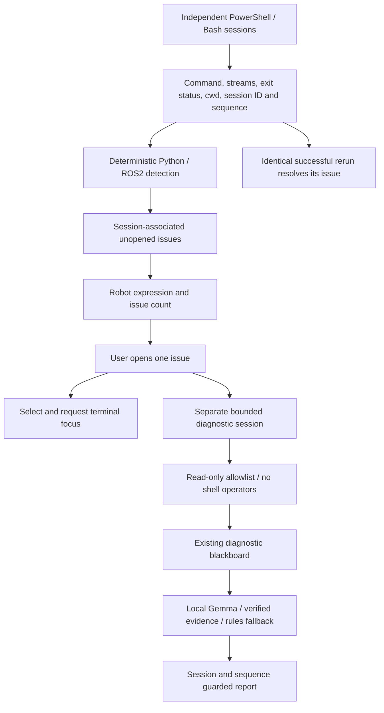
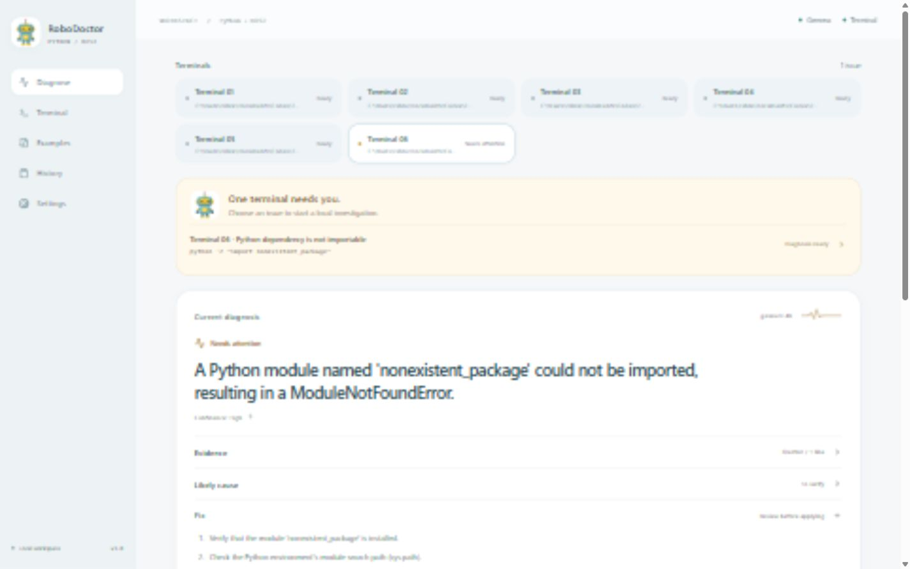
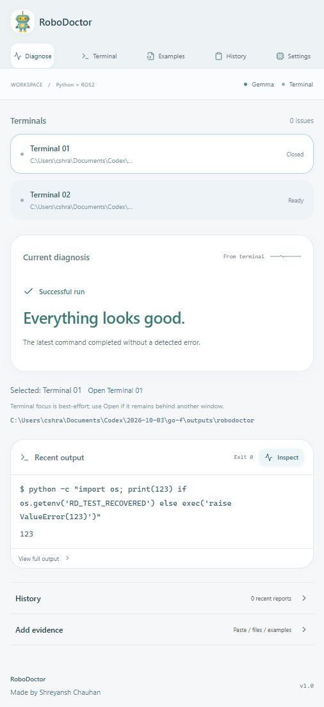
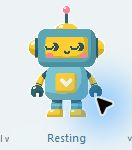

# RoboDoctor

A quiet local companion for Python and ROS2 development. Run commands in several managed terminals. The supplied robot notices failures; double-click it to open one issue, or choose among several, and review a local diagnosis in your browser. Successful runs receive **✓ Everything looks good.**

RoboDoctor exists to make confusing development and robotics errors easier to understand without giving an assistant control of your project. Gemma runs locally through Ollama; no API key or cloud service is used. Existing log paste, file upload, ROS2 detectors, and examples remain available.

## Ubuntu: from a fresh machine to your first diagnosis

Use a local Ubuntu desktop with Bash. Ubuntu 22.04 or 24.04 provides Python 3.10+ through its package manager. The desktop robot needs a graphical session; a headless machine can run the web workspace with `--web-only`. Ubuntu desktop behavior has not yet been tested on a real Ubuntu machine; see [VERIFICATION.md](VERIFICATION.md) for the checks actually completed.

### 1. Install system dependencies and clone

Open Ubuntu Terminal and run:

```bash
sudo apt update
sudo apt install -y git curl ca-certificates python3 python3-venv python3-tk
git clone https://github.com/Shreyansh08-bit/RoboDoctor.git robodoctor
cd robodoctor
```

All following commands run from this `robodoctor` directory unless stated otherwise. If using the source ZIP instead, extract it and open a terminal in the extracted directory containing `start.sh`, `backend`, and `frontend`. Create fresh Linux dependencies; do not copy a Windows `.venv` or `node_modules` folder.

### 2. Install Node.js and npm

The project includes `.nvmrc` selecting Node 22. Install [nvm using its official instructions](https://github.com/nvm-sh/nvm#installing-and-updating), then load it into this terminal:

```bash
curl -fsSL https://raw.githubusercontent.com/nvm-sh/nvm/v0.40.8/install.sh | bash
export NVM_DIR="$([ -z "${XDG_CONFIG_HOME-}" ] && printf %s "${HOME}/.nvm" || printf %s "${XDG_CONFIG_HOME}/nvm")"
[ -s "$NVM_DIR/nvm.sh" ] && . "$NVM_DIR/nvm.sh"
nvm install
nvm use
node --version
npm --version
```

If you already have a compatible Node installation, you can skip installing nvm. Vite requires Node 20.19+ or 22.12+; this guide selects the latest Node 22 release. An older Ubuntu `nodejs` package may not meet that requirement. Do not use `sudo npm`.

### 3. Install project dependencies

```bash
python3 -m venv .venv
.venv/bin/python -m pip install -r backend/requirements.txt
[ -f .env ] || cp .env.example .env
npm ci --prefix frontend
.venv/bin/python --version
.venv/bin/python -c "import tkinter; print('Tk is available')"
```

The Python environment belongs to RoboDoctor. You do not need to activate it to start the app: `start.sh` uses its interpreter explicitly. Your managed Bash terminals inherit the environment you launch RoboDoctor from, so use `python3` for the demos below. For your own project, source that project's environment before launch or inside its managed terminal.

The default `.env` uses `http://127.0.0.1:11434`, model `gemma3:4b`, and a 180-second AI timeout. No API key is required. Keep custom `.env` values when updating the project.

### 4. Install Ollama and download Gemma

Follow the [official Ollama Linux setup](https://docs.ollama.com/linux):

```bash
curl -fsSL https://ollama.com/install.sh | sh
```

On Ubuntu with systemd, check and start its service:

```bash
sudo systemctl start ollama
systemctl status ollama --no-pager
```

If your installation does not use systemd, run `ollama serve` in a separate terminal and leave it open. Use only one Ollama server. Back in your project terminal:

```bash
ollama pull gemma3:4b
ollama list
ollama run gemma3:4b "Reply with the word Ready."
curl -fsS http://127.0.0.1:11434/api/tags
```

The model download needs several GB of disk space and internet access. CPU inference can take a minute or more, depending on your machine; a compatible GPU can improve speed. After dependencies and the model are installed, local diagnosis does not need internet. Without Ollama or Gemma, the app can still detect errors and show its clearly labeled rules fallback.

### 5. Start the app

```bash
bash start.sh
```

Keep this terminal open. Open [RoboDoctor](http://127.0.0.1:5173/) in your browser. The script starts the backend on port 8000, the frontend on port 5173, and the floating desktop robot. It does not open a managed terminal automatically. Right-click the robot and choose **New managed terminal**. Double-clicking the robot opens the workspace or a pending issue. Linux compositors may affect window placement, transparency, and focus.

In another Ubuntu terminal, verify the backend:

```bash
curl -fsS http://127.0.0.1:8000/api/health
```

For a different initial working directory, use an existing directory:

```bash
bash start.sh --cwd "$HOME/your-project"
```

For a machine without a graphical session:

```bash
bash start.sh --web-only
```

Web-only mode provides paste, upload, and examples; it does not create the desktop robot or its managed terminals. The servers bind to localhost. If running on a remote Ubuntu machine, forward ports 5173 and 8000 over SSH to use the workspace locally. Press **Ctrl+C** in the startup terminal to stop RoboDoctor; Ollama's service remains independent.

### 6. Test an error, a recovery, and ROS2

Enter this single line in the robot's managed terminal and press **Run**:

```bash
python3 -c "import os; assert os.getenv('ROBODOCTOR_DEMO_OK') == '1', 'demo failure'; print('Recovered')"
```

The robot should show an issue. Double-click it to open the failed execution and start diagnosis. Wait for the report; the workspace identifies whether Gemma or the rules fallback produced it. Now run these **as two separate commands in the same managed terminal**:

```bash
export ROBODOCTOR_DEMO_OK=1
python3 -c "import os; assert os.getenv('ROBODOCTOR_DEMO_OK') == '1', 'demo failure'; print('Recovered')"
```

The identical successful rerun resolves that issue and shows **Everything looks good**. An unrelated successful command does not clear an earlier failure. Create another managed terminal to check session isolation.

ROS2 is optional. To inspect ROS2 examples, open **Examples** without installing ROS2. To execute real ROS2 commands, install the distribution matching your Ubuntu version using the [official ROS2 installation guide](https://docs.ros.org/en/jazzy/Installation.html). Source your installed ROS2 distribution and workspace **before launching RoboDoctor** so backend diagnostic probes can find the same tools:

```bash
# Replace DISTRO with your installed ROS2 distribution.
source /opt/ros/DISTRO/setup.bash
# If you have already built your workspace:
source "$HOME/your_ros_workspace/install/setup.bash"
bash start.sh --cwd "$HOME/your_ros_workspace"
```

Then run `ros2 run missing_demo missing_node` in a managed terminal to test a package-not-found failure. Source paths are examples: use your existing installation and workspace, and skip the workspace line if you have none. RoboDoctor does not install ROS2 or build your robot project for you.

### Daily startup after installation

```bash
cd /path/to/robodoctor
# If using nvm:
nvm use
# Source ROS2 / your project environment here if needed.
bash start.sh
```

You only repeat dependency installation after dependency changes, or when setting up another machine. Use `git pull --ff-only` to update a clean checkout, then rerun `.venv/bin/python -m pip install -r backend/requirements.txt` and `npm ci --prefix frontend` if their requirements or lockfile changed. Preserve local work before updating.

### Ubuntu troubleshooting

| Symptom | What to check |
| --- | --- |
| `nvm: command not found` | Open a fresh Bash terminal, or load the `nvm.sh` file as shown above. Run `nvm use` from the project root. |
| Node version / Vite error | Check `node --version`; select Node 22 with `nvm install` and `nvm use`, then rerun `npm ci --prefix frontend`. |
| Python reports `externally-managed-environment` | Install dependencies with `.venv/bin/python -m pip`, rather than system `pip`. |
| `No module named tkinter` | Install `python3-tk` for your Ubuntu Python. A custom Python build may need matching Tk support. |
| Tk reports no display / no robot | Start from your graphical desktop session. For headless use, choose `--web-only`. |
| Workspace cannot reach backend | Check the startup terminal and `/api/health` on port 8000. Both frontend and backend must be running. |
| Port already in use | Stop the previous app in its startup terminal with Ctrl+C, then restart. Do not launch the combined script alongside separate development servers. |
| Ollama unreachable | Check `systemctl status ollama` or the terminal running `ollama serve`, and confirm `.env` has the correct local API address. |
| Gemma missing | Run `ollama pull gemma3:4b`; `ollama list` must show the exact name configured in `.env`. |
| Diagnosis times out | Confirm the standalone `ollama run` test works. CPU inference can be slow; adjust `AI_TIMEOUT_SECONDS` in `.env` and restart the backend if needed. |
| ROS2 tools missing from probes | Source the ROS2 setup before starting RoboDoctor, then restart it. A setup sourced only inside a managed terminal does not update the backend's PATH. |
| `bash` reports carriage returns (`\r`) | Use a fresh Git checkout; `.gitattributes` preserves LF for shell scripts. For an old copied file, run `sed -i 's/\r$//' start.sh`. |
| No internet during first setup | Dependencies and model weights must be downloaded first. Once installed, the app uses local services. |

## Architecture



The existing launcher, terminal runner, React workspace, FastAPI service, blackboard, detectors and Ollama integration are extended in place. Capture never calls Gemma. Each session has a unique ID, private token, heartbeat, independent execution sequence and recent-command context. A user-opened issue can run up to three read-only evidence probes, then uses the existing structured diagnosis pipeline. Reports carry `session_id`, `execution_sequence` and `issue_id`; stale responses cannot replace newer execution state. Examples remain clearly separate from current terminal observations.

## Requirements and platforms

- Windows with PowerShell, or Ubuntu/Linux with Bash and a graphical desktop.
- Python 3.10 or newer with Tk. Node.js 20.19+ (or 22.12+) and npm for the web workspace.
- Ollama and `gemma3:4b` for AI reasoning. Deterministic rules and healthy detection work without them.
- ROS2 is needed only when executing real ROS2 commands, not to inspect captured logs or examples.

Mac support is outside this MVP. Linux window managers, particularly Wayland compositors, may restrict always-on-top placement. The managed terminal uses pipes, not a full interactive TTY.

## One-time project setup

Run these commands yourself from the project folder. The launch scripts check existing dependencies; they do not install packages or models.

Windows PowerShell:

```powershell
python -m venv .venv
.\.venv\Scripts\python.exe -m pip install -r backend\requirements.txt
Copy-Item .env.example .env
cd frontend
npm ci
cd ..
```

Ubuntu/Linux: follow the complete [Ubuntu guide above](#ubuntu-from-a-fresh-machine-to-your-first-diagnosis), including cloning, system dependencies, Node, Python, and the first terminal run.

Do not overwrite an existing `.env` with customized settings. The default configuration is:

```dotenv
OLLAMA_BASE_URL=http://127.0.0.1:11434
MODEL_NAME=gemma3:4b
AI_TIMEOUT_SECONDS=180
```

## Ollama and Gemma setup

The workspace checks three conditions separately: whether Ollama is installed, whether its API is reachable, and whether the configured model is available. Its setup panel tells you which step is missing and checks again automatically.

Windows: use the [official Ollama download](https://ollama.com/download/windows), or explicitly run its PowerShell installer:

```powershell
irm https://ollama.com/install.ps1 | iex
```

Ubuntu/Linux: use the [official Linux instructions](https://ollama.com/download/linux), or explicitly run:

```bash
curl -fsSL https://ollama.com/install.sh | sh
```

Start Ollama, then explicitly obtain the model:

```bash
ollama pull gemma3:4b
```

The first run downloads several gigabytes (approximately 3.3 GB for the default model). RoboDoctor never performs this download for you. Once installed, diagnosis is local and can work offline. Gemma has its own model terms; the project's MIT license covers RoboDoctor source code. If Gemma is unavailable or returns unverified output, the workspace clearly labels the deterministic rules fallback. There is no cloud fallback.

## Start RoboDoctor

Windows:

```powershell
powershell -ExecutionPolicy Bypass -File .\start.ps1
# Optional initial working directory for the managed terminal:
powershell -ExecutionPolicy Bypass -File .\start.ps1 -ProjectPath C:\path\to\your\project
# Web workspace only:
powershell -ExecutionPolicy Bypass -File .\start.ps1 -WebOnly
```

Ubuntu/Linux:

```bash
bash start.sh
bash start.sh --cwd /path/to/your/project
bash start.sh --web-only
```

The workspace is at http://127.0.0.1:5173 and the backend at http://127.0.0.1:8000. Keep the startup terminal open; Ctrl+C stops the processes it started. If those ports are occupied, stop the old RoboDoctor instance first. No elevated privileges are needed to run it.

To attach just the desktop companion to already running RoboDoctor servers:

```powershell
.\.venv\Scripts\python.exe -m companion.desktop --cwd C:\path\to\your\project
```

On Linux use `.venv/bin/python` and a Linux path. Add `--terminal` to open the managed terminal immediately.

## Floating icon and managed terminal

The supplied teal/yellow robot is the actual desktop character, sidebar image and favicon. It rests quietly, looks concerned when an unopened issue appears, shows an issue count for multiple failures, changes expression while investigating, and reports diagnosis-ready or needs-more-evidence states. Windows uses a transparent background around the character. Drag it to a convenient location; right-click for **Open workspace**, **New managed terminal**, or **Quit companion**.

Choose **New managed terminal** repeatedly to create independent Terminal 01, Terminal 02, Terminal 03, and so on (maximum 32 per backend lifetime). Each opens a persistent PowerShell session on Windows or Bash on Linux. Type a complete single-line command and press **Run** or Enter. `cd`, environment variables and Linux `source` persist. The runner captures stdout and stderr separately, combined output, exit status, cwd, timestamp, selected ROS/environment metadata, session ID and sequence. **Stop** ends that shell's process tree. Closing a terminal disconnects only that session.

Failures are detected automatically without inference. Double-click with one unresolved issue to select its terminal, request focus, load the failed execution, and start diagnosis. With several issues, double-click opens the chooser; select one to investigate. With none, it opens the current healthy/idle workspace. Reopening an already diagnosed execution reuses its report. Terminal focus is best-effort and never claimed as confirmed; the workspace provides **Open Terminal NN** as a fallback. Programmatic shell clients do not have a GUI window to focus.

An identical command that subsequently exits successfully without detected runtime errors resolves its previous issue in that session. An unrelated successful command does not erase another command's unresolved failure. Older unresolved issues with newer intervening runs cannot overwrite current output; rerun the failing command to produce fresh evidence if needed.

The **RoboDoctor Diagnostic Terminal** is separate from your terminals. Gemma can request at most three probes; each probe has a six-second timeout and a 4,000-byte output cap. Allowed commands are `pwd`, `ls`, `which NAME`, Python version, `pip list/show`, selected ROS2 list/prefix/interface/doctor queries, and limited Git status/branch/log. Commands use validated argv with no shell. Operators, arbitrary Python code, package installation, file writes, destructive Git operations and hardware actuation are rejected. Diagnostic PATH comes from the backend process, with captured ROS metadata and virtual-environment context; this is not a full clone of every shell variable. Missing diagnostic tools are reported explicitly.

This MVP supports noninteractive commands, not password prompts, full-screen tools, interactive Python/REPLs, editors, or arbitrary terminals outside RoboDoctor. There is no terminal scraping. Output is bounded to the latest 12,000 characters; long executions can lose earlier lines. Paste or upload fuller evidence when needed. A running or cancelled command is not treated as a successful run.

## Try the workflow

Python error:

```bash
python -c "raise ModuleNotFoundError('No module named missing_demo')"
```

Double-click the robot. Review the observed exception, interpreter/environment checks, conditional fixes, and copyable suggestions. Import names do not always equal installable package names.

ROS2 example (in a configured ROS2 environment):

```bash
ros2 run missing_demo missing_node
```

Review package discovery, workspace sourcing, and executable checks. If ROS2 is absent, the missing executable itself is diagnosed. Built-in examples also cover QoS, TF, YAML parameters, lifecycle, navigation, package errors, and workspace builds without requiring ROS2 installation.

Healthy run:

```bash
python -c "print('Robot initialized successfully.'); print('Connected to controller.'); print('Mission started.')"
```

After exit code 0 with no meaningful detected error, RoboDoctor displays **✓ Everything looks good.** It does not reuse an older failure or invent a fix. This describes the captured execution, not a guarantee about unseen hardware or the entire project. Pasted text without execution metadata cannot establish a successful exit.

## Workspace

The light workspace uses curved surfaces, soft blue/teal accents, quiet shadows and smooth interactions. A terminal roster and issue chooser precede the selected diagnosis. The workspace gives the current diagnosis and fix the strongest emphasis. Evidence, likely causes, commands, explanations, and confidence details expand when needed. The recent-output terminal shows a short preview with full captured output available below. History and additional evidence stay collapsed by default. Sidebar navigation links Diagnose, Terminal, Examples, History, and Settings without adding pages.

A small signal trace reflects actual idle, analyzing, warning, and healthy states. Your supplied robot appears in the desktop launcher, sidebar, and favicon. Web animations honor reduced-motion preferences; there is no staged thinking sequence. The footer reads **RoboDoctor — Made by Shreyansh Chauhan · v1.0**.

History contains real backend records, not sample metrics. Click a report to revisit it. Paste, uploads, eleven examples, copyable suggestions, and explicit model setup remain available.







## User control and limits

- Fix suggestions are never applied. Opening an issue authorizes bounded read-only diagnostic probes through the allowlist; there is no arbitrary command-execution endpoint. The diagnostic engine does not edit project files, install packages or actuate hardware.
- Project startup never installs dependencies or downloads a model. Setup commands require your explicit action.
- Each managed session uses its own private token and heartbeat; unrelated browser origins are rejected. Servers are loopback-only and intended for one local user, not public hosting.
- The latest execution, blackboard, and last twelve reports are process-local memory. Restarting the backend clears them; no database or persistent memory system is added.
- Gemma receives relevant evidence capped at 14,000 characters, selected environment keys, and at most three short previous summaries. History is context, not evidence for the current run.
- Do not paste secrets. Selected evidence is sent to your configured local Ollama runtime. File contents and terminal text are treated as untrusted diagnostic data.
- Rules cover common Python and ROS2 patterns, not every programming language or error. Model output can be wrong; verify suggestions against your actual environment before running them.

## Development and validation

Complete the first-time setup above before developing. Work from the repository root and use a branch for your changes:

```bash
git switch -c your-change
```

For normal use, `bash start.sh` is enough. For development with backend reload and frontend hot reload, stop that script and use three separate Ubuntu terminals instead:

**Terminal 1 — backend**, from the repository root:

```bash
.venv/bin/python -m uvicorn app.main:app --app-dir backend --reload --host 127.0.0.1 --port 8000
```

**Terminal 2 — frontend**, from the repository root:

```bash
nvm use
npm run dev --prefix frontend -- --strictPort
```

**Terminal 3 — companion**, from the repository root:

```bash
.venv/bin/python -m companion.desktop --cwd "$PWD" --terminal
```

The frontend uses port 5173 and talks to the backend on port 8000. Restart the companion after changing Python UI code. Stop each process with Ctrl+C in its own terminal. Source any required ROS2 setup in the backend and companion terminals before starting them. Keep Ollama running separately for AI integration checks.

Before submitting a change, run the regression suite and production build from the repository root:

```bash
.venv/bin/python -m pytest backend/tests -q
npm run build --prefix frontend
git diff --check
```

The automated suite does not need a live Gemma server or installed ROS2. Changes affecting local inference, terminal behavior, or the robot also need a manual error → open issue → diagnosis → identical successful rerun check. Validate real ROS2 commands in an installed ROS2 environment when changing ROS integration. Record your platform and any untested behavior rather than treating a passing build as desktop verification.

Keep `.env`, `.venv`, `node_modules`, generated builds, and credentials out of commits; `.gitignore` covers the local dependency folders and `.env`. Commit `frontend/package-lock.json` with frontend dependency changes so `npm ci` remains reproducible. Add meaningful detector/session regression cases under `backend/tests` when changing those behaviors. If you do not have write access to the upstream repository, fork it, clone your fork, and open a pull request against the upstream project. Include what changed and how you checked it.

Windows:

```powershell
.\.venv\Scripts\python.exe -m pytest backend\tests -q
cd frontend
npm run build
```

Linux: use `.venv/bin/python -m pytest backend/tests -q`. See [VERIFICATION.md](VERIFICATION.md) for results, native UI checks, and remaining platform/model limits.

Key code locations:

| Location | Responsibility |
| --- | --- |
| `companion/desktop.py` | Small Tk launcher and managed-terminal UI |
| `companion/session.py` | Persistent PowerShell/Bash, execution metadata, bounded output |
| `backend/app/state.py` | Isolated sessions, issue lifecycle, latest diagnosis, bounded history |
| `backend/app/diagnostics/investigation.py` | Local probe planning, strict argv allowlist, bounded read-only evidence |
| `backend/app/service.py` | One diagnosis pipeline and first-class healthy state |
| `backend/app/diagnostics/blackboard.py` | Relevant structured context |
| `backend/app/diagnostics/development.py` | Extensible Python/build detectors |
| `backend/app/diagnostics/parser.py` | Preserved ROS2 detectors |
| `backend/app/ai/local.py` | Local Ollama/Gemma status and validated structured responses |
| `frontend/src/App.tsx` | Shared compact workspace and explicit setup guidance |

If the launcher says offline, check the backend startup terminal. If Ollama is installed but unreachable, start its application/service. If the model is missing, run the explicit Gemma command above. If your terminal disconnects, reopen it from the robot menu. If a diagnosis has insufficient evidence, supply the exact failing command and relevant traceback/configuration.

## Focused roadmap

Improve detector coverage with real-world Python/ROS2 fixtures, validate Ubuntu desktop behavior across window managers, and improve long-running cancellation and evidence selection. A full interactive terminal could follow after the current workflow is dependable. Extensions, autonomous fixes, accounts, cloud inference, databases, voice, and Mac support are outside this MVP.
