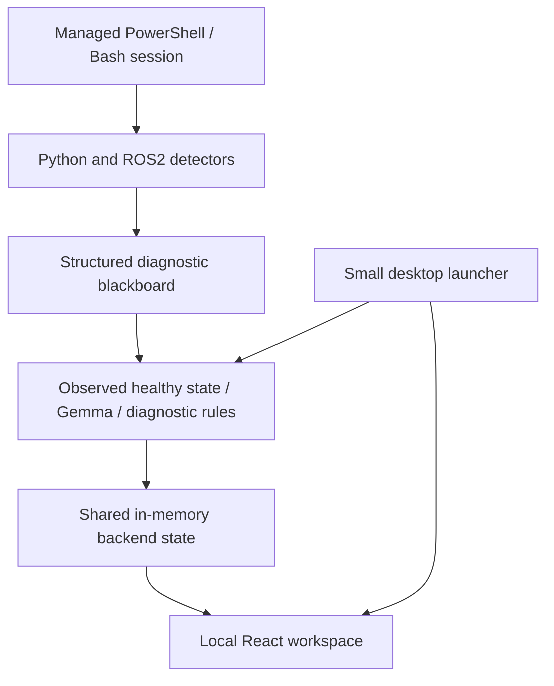
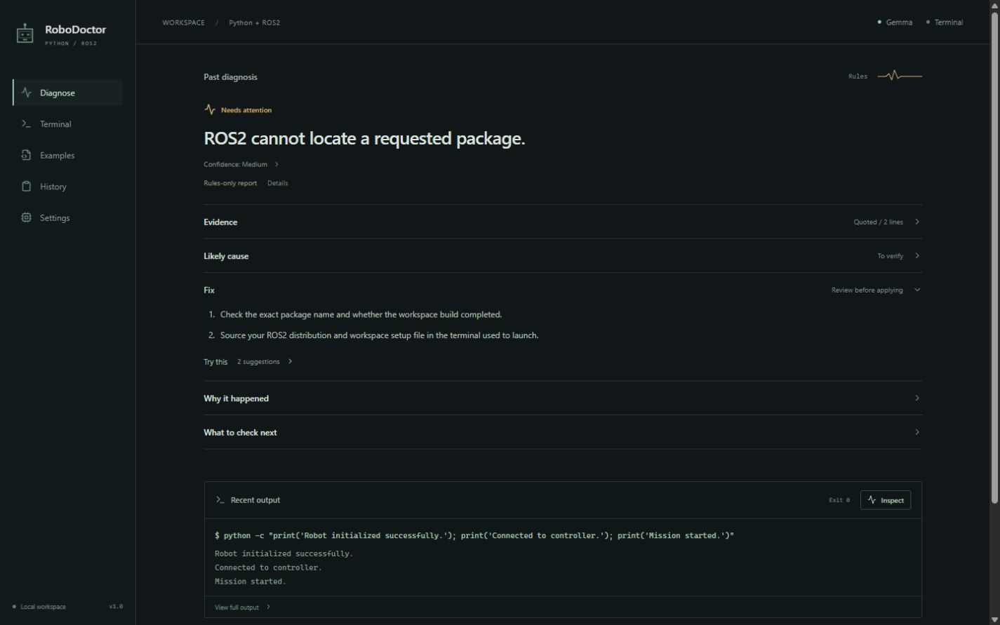
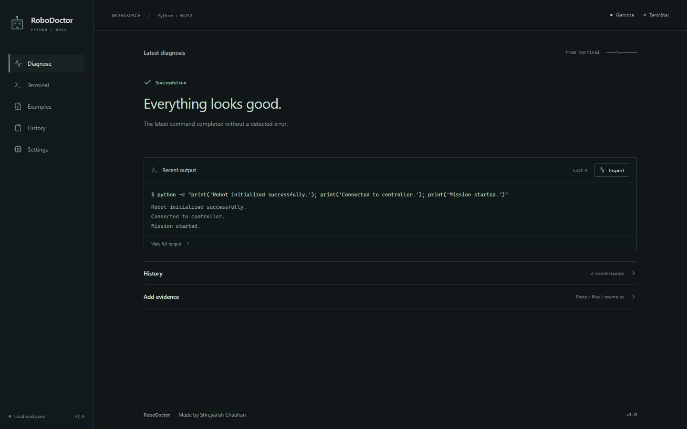
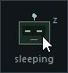

# RoboDoctor

A quiet local companion for Python and ROS2 development. Run a command in its managed terminal, double-click the small sleeping desktop robot, and review a concise diagnosis in your browser. Successful runs receive **✓ Everything looks good.**

RoboDoctor exists to make confusing development and robotics errors easier to understand without giving an assistant control of your project. Gemma runs locally through Ollama; no API key or cloud service is used. Existing log paste, file upload, ROS2 detectors, and examples remain available.

## Architecture



The Tk launcher and React workspace use the same FastAPI backend, blackboard, Ollama client, and recent diagnosis history. The launcher is an entry point, not another diagnostic application. The blackboard organizes language, selected environment values, ROS2 information, detector hints, exact evidence, severity, execution metadata, and short historical summaries. Only bounded relevant evidence is sent to Gemma. Evidence is observed; root causes and fixes are interpretations and suggestions.

## Requirements and platforms

- Windows with PowerShell, or Ubuntu/Linux with Bash and a graphical desktop.
- Python 3.10 or newer with Tk. Node.js 20.19+ (or 22.12+) and npm for the web workspace.
- Ollama and `gemma3:4b` for AI reasoning. Deterministic rules and healthy detection work without them.
- ROS2 is needed only when executing real ROS2 commands, not to inspect captured logs or examples.

Mac support is outside this MVP. Linux window managers, particularly Wayland compositors, may restrict always-on-top placement. The managed terminal uses pipes, not a full interactive TTY.

## One-time project setup

Run these commands yourself from the project folder. The launch scripts check existing dependencies; they do not install packages or models.

Windows PowerShell:

```powershell
python -m venv .venv
.\.venv\Scripts\python.exe -m pip install -r backend\requirements.txt
Copy-Item .env.example .env
cd frontend
npm ci
cd ..
```

Ubuntu/Linux:

```bash
# If Python's Tk or venv support is missing:
sudo apt install python3-tk python3-venv
python3 -m venv .venv
.venv/bin/python -m pip install -r backend/requirements.txt
cp .env.example .env
cd frontend
npm ci
cd ..
```

Do not overwrite an existing `.env` with customized settings. The default configuration is:

```dotenv
OLLAMA_BASE_URL=http://127.0.0.1:11434
MODEL_NAME=gemma3:4b
AI_TIMEOUT_SECONDS=180
```

## Ollama and Gemma setup

The workspace checks three conditions separately: whether Ollama is installed, whether its API is reachable, and whether the configured model is available. Its setup panel tells you which step is missing and checks again automatically.

Windows: use the [official Ollama download](https://ollama.com/download/windows), or explicitly run its PowerShell installer:

```powershell
irm https://ollama.com/install.ps1 | iex
```

Ubuntu/Linux: use the [official Linux instructions](https://ollama.com/download/linux), or explicitly run:

```bash
curl -fsSL https://ollama.com/install.sh | sh
```

Start Ollama, then explicitly obtain the model:

```bash
ollama run gemma3:4b
```

The first run downloads several gigabytes (approximately 3.3 GB for the default model). RoboDoctor never performs this download for you. Once installed, diagnosis is local and can work offline. Gemma has its own model terms; the project's MIT license covers RoboDoctor source code. If Gemma is unavailable or returns unverified output, the workspace clearly labels the deterministic rules fallback. There is no cloud fallback.

## Start RoboDoctor

Windows:

```powershell
powershell -ExecutionPolicy Bypass -File .\start.ps1
# Optional initial working directory for the managed terminal:
powershell -ExecutionPolicy Bypass -File .\start.ps1 -ProjectPath C:\path\to\your\project
# Web workspace only:
powershell -ExecutionPolicy Bypass -File .\start.ps1 -WebOnly
```

Ubuntu/Linux:

```bash
bash start.sh
bash start.sh --cwd /path/to/your/project
bash start.sh --web-only
```

The workspace is at http://127.0.0.1:5173 and the backend at http://127.0.0.1:8000. Keep the startup terminal open; Ctrl+C stops the processes it started. If those ports are occupied, stop the old RoboDoctor instance first. No elevated privileges are needed to run it.

To attach just the desktop companion to already running RoboDoctor servers:

```powershell
.\.venv\Scripts\python.exe -m companion.desktop --cwd C:\path\to\your\project
```

On Linux use `.venv/bin/python` and a Linux path. Add `--terminal` to open the managed terminal immediately.

## Floating icon and managed terminal

The small robot normally sleeps quietly above ordinary windows. Its eyes breathe subtly; activity and warning states remain restrained. It initially sits away from the Windows notification corner. Drag it to a convenient location. Double-click to open the workspace in your default browser and inspect the latest completed managed execution. Right-click for **Open workspace**, **Open managed terminal**, or **Quit**.

The managed terminal starts a persistent PowerShell session on Windows or Bash on Linux. Type a complete single-line command and press **Run** or Enter. Only this explicit action executes commands. `cd`, environment variables, and Linux `source` changes persist between runs. Output and actual exit status are captured together; **Inspect** requests diagnosis without executing anything. **Stop** terminates the managed shell process tree and resets the session for the next run. Closing the terminal disconnects it.

This MVP supports noninteractive commands, not password prompts, full-screen tools, interactive Python/REPLs, editors, or arbitrary terminals outside RoboDoctor. There is no terminal scraping. Output is bounded to the latest 12,000 characters; long executions can lose earlier lines. Paste or upload fuller evidence when needed. A running or cancelled command is not treated as a successful run.

## Try the workflow

Python error:

```bash
python -c "raise ModuleNotFoundError('No module named missing_demo')"
```

Double-click the robot. Review the observed exception, interpreter/environment checks, conditional fixes, and copyable suggestions. Import names do not always equal installable package names.

ROS2 example (in a configured ROS2 environment):

```bash
ros2 run missing_demo missing_node
```

Review package discovery, workspace sourcing, and executable checks. If ROS2 is absent, the missing executable itself is diagnosed. Built-in examples also cover QoS, TF, YAML parameters, lifecycle, navigation, package errors, and workspace builds without requiring ROS2 installation.

Healthy run:

```bash
python -c "print('Robot initialized successfully.'); print('Connected to controller.'); print('Mission started.')"
```

After exit code 0 with no meaningful detected error, RoboDoctor displays **✓ Everything looks good.** It does not reuse an older failure or invent a fix. This describes the captured execution, not a guarantee about unseen hardware or the entire project. Pasted text without execution metadata cannot establish a successful exit.

## Workspace

The workspace gives the latest diagnosis and fix the strongest emphasis. Evidence, likely causes, commands, explanations, and confidence details expand when needed. The recent-output terminal shows a short preview with full captured output available below. History and additional evidence stay collapsed by default. Sidebar navigation links Diagnose, Terminal, Examples, History, and Settings without adding pages.

A small signal trace reflects actual idle, analyzing, warning, and healthy states. The same restrained robot mark appears in the desktop launcher, sidebar, and favicon. Web animations honor reduced-motion preferences; there is no staged thinking sequence. The footer reads **RoboDoctor — Made by Shreyansh Chauhan · v1.0**.

History contains real backend records, not sample metrics. Click a report to revisit it. Paste, uploads, eleven examples, copyable suggestions, and explicit model setup remain available.







## User control and limits

- Suggested commands are never executed. The browser backend has no command-execution endpoint. Files are never edited, deleted, or fixed by the diagnostic engine.
- Project startup never installs dependencies or downloads a model. Setup commands require your explicit action.
- One managed session uses a private token and heartbeat; unrelated browser origins are rejected. Servers are loopback-only and intended for one local user, not public hosting.
- The latest execution, blackboard, and last twelve reports are process-local memory. Restarting the backend clears them; no database or persistent memory system is added.
- Gemma receives relevant evidence capped at 14,000 characters, selected environment keys, and at most three short previous summaries. History is context, not evidence for the current run.
- Do not paste secrets. Selected evidence is sent to your configured local Ollama runtime. File contents and terminal text are treated as untrusted diagnostic data.
- Rules cover common Python and ROS2 patterns, not every programming language or error. Model output can be wrong; verify suggestions against your actual environment before running them.

## Development and validation

Windows:

```powershell
.\.venv\Scripts\python.exe -m pytest backend\tests -q
cd frontend
npm run build
```

Linux: use `.venv/bin/python -m pytest backend/tests -q`. See [VERIFICATION.md](VERIFICATION.md) for results, native UI checks, and remaining platform/model limits.

Key code locations:

| Location | Responsibility |
| --- | --- |
| `companion/desktop.py` | Small Tk launcher and managed-terminal UI |
| `companion/session.py` | Persistent PowerShell/Bash, execution metadata, bounded output |
| `backend/app/state.py` | Shared session, latest diagnosis, bounded history |
| `backend/app/service.py` | One diagnosis pipeline and first-class healthy state |
| `backend/app/diagnostics/blackboard.py` | Relevant structured context |
| `backend/app/diagnostics/development.py` | Extensible Python/build detectors |
| `backend/app/diagnostics/parser.py` | Preserved ROS2 detectors |
| `backend/app/ai/local.py` | Local Ollama/Gemma status and validated structured responses |
| `frontend/src/App.tsx` | Shared compact workspace and explicit setup guidance |

If the launcher says offline, check the backend startup terminal. If Ollama is installed but unreachable, start its application/service. If the model is missing, run the explicit Gemma command above. If your terminal disconnects, reopen it from the robot menu. If a diagnosis has insufficient evidence, supply the exact failing command and relevant traceback/configuration.

## Focused roadmap

Improve detector coverage with real-world Python/ROS2 fixtures, validate Ubuntu desktop behavior across window managers, and improve long-running cancellation and evidence selection. A full interactive terminal could follow after the current workflow is dependable. Extensions, autonomous fixes, accounts, cloud inference, databases, voice, and Mac support are outside this MVP.
